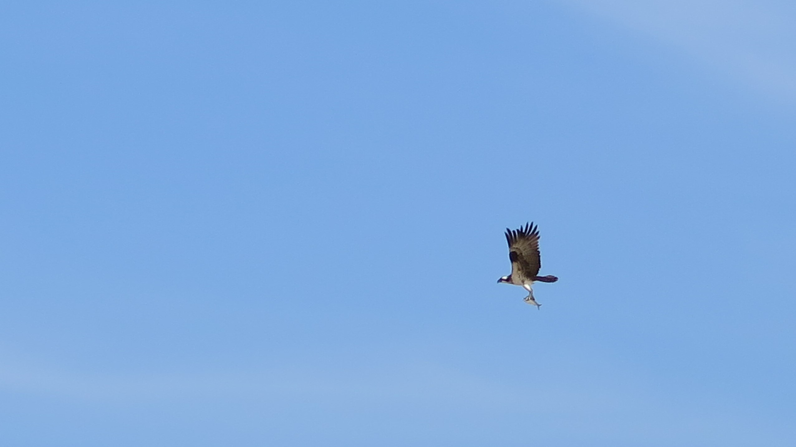

```{r setup, include=FALSE}
knitr::opts_chunk$set(echo = FALSE)
```

I graduated from the University of Virginia in 2016 with a Bachelor of Science in environmental science and a Bachelor of Arts in leadership and public policy. After graduation, I spent a few years working for the Chesapeake Bay Program before returning to school for my master's degree in environmental science and management. 

I am driven by the intersection of science and policy and am excited to be learning so much while at the Bren School.



RESUME

```{r echo = FALSE, message = FALSE, fig.align='left', fig.pos='H', out.width="800px", out.height="1100px"}
knitr::include_graphics("Abowd_Laurel_Resume_Website.pdf")

```

